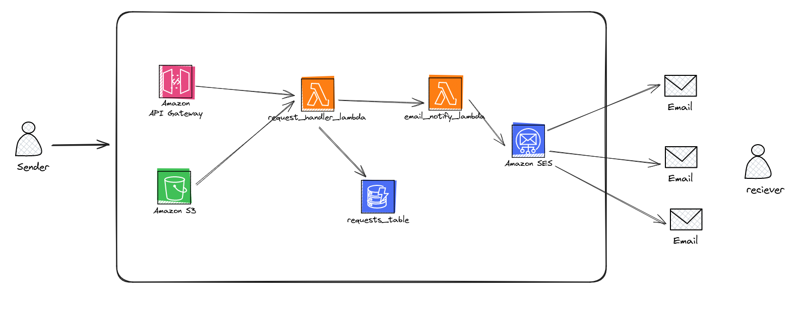

# emailNotifyer

a serverless application to send emails based on AWS SES

## Global Architicture

## AWS Resources Needed for the CDK IAM User

- **CloudFormation Permissions**:
  - `cloudformation:CreateStack`
  - `cloudformation:UpdateStack`
  - `cloudformation:DeleteStack`

- **Lambda Permissions**:
  - `lambda:CreateFunction`
  - `lambda:AddPermission`
  - `lambda:UpdateFunctionCode`
  - `lambda:UpdateFunctionConfiguration`
  - `lambda:DeleteFunction`

- **DynamoDB Permissions**:
  - `dynamodb:CreateTable`
  - `dynamodb:DescribeTable`
  - `dynamodb:UpdateTable`

- **API Gateway Permissions**:
  - `apigateway:CreateRestApi`
  - `apigateway:CreateResource`
  - `apigateway:PutMethod`
  - `apigateway:PutIntegration`
  - `apigateway:CreateDeployment`
  - `apigateway:DeleteRestApi`

- **S3 Permissions**:
  - `s3:CreateBucket`
  - `s3:PutObject`
  - `s3:GetObject`
  - `s3:DeleteObject`
  - `s3:ListBucket`

- **IAM Permissions**:
  - `iam:CreateRole`
  - `iam:AttachRolePolicy`
  - `iam:PassRole`
