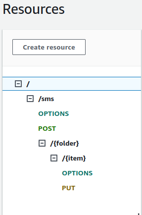
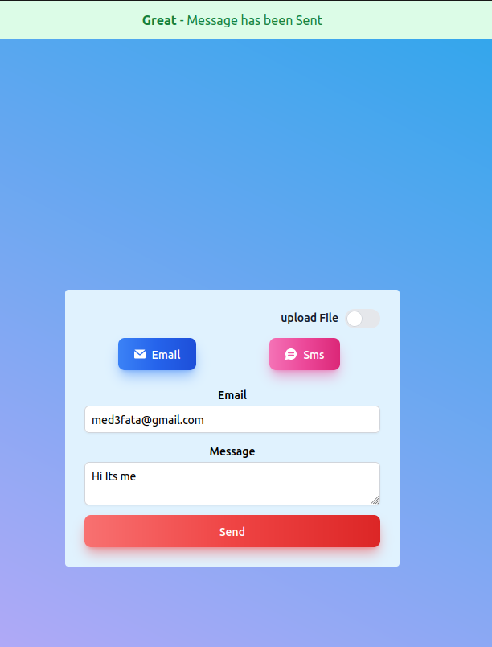
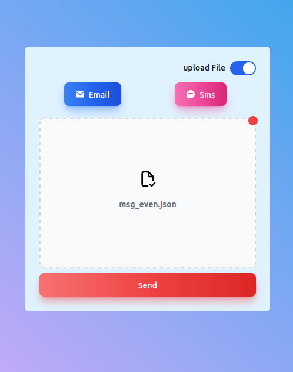

# emailNotifyer

a serverless application to send emails based on AWS SES

## Global Architicture


## AWS Resources Needed for the CDK IAM User

- **CloudFormation Permissions**:
  - `cloudformation:CreateStack`
  - `cloudformation:UpdateStack`
  - `cloudformation:DeleteStack`

- **Lambda Permissions**:
  - `lambda:CreateFunction`
  - `lambda:AddPermission`
  - `lambda:UpdateFunctionCode`
  - `lambda:UpdateFunctionConfiguration`
  - `lambda:DeleteFunction`

- **DynamoDB Permissions**:
  - `dynamodb:CreateTable`
  - `dynamodb:DescribeTable`
  - `dynamodb:UpdateTable`

- **API Gateway Permissions**:
  - `apigateway:CreateRestApi`
  - `apigateway:CreateResource`
  - `apigateway:PutMethod`
  - `apigateway:PutIntegration`
  - `apigateway:CreateDeployment`
  - `apigateway:DeleteRestApi`

- **S3 Permissions**:
  - `s3:CreateBucket`
  - `s3:PutObject`
  - `s3:GetObject`
  - `s3:DeleteObject`
  - `s3:ListBucket`

- **IAM Permissions**:
  - `iam:CreateRole`
  - `iam:AttachRolePolicy`
  - `iam:PassRole`

## API GATEWAY Endpoints



As we can see, the API Gateway has 2 endpoints:

- **POST**: `/sms/`
  - **Method**: POST
  - **Path**: /sms/
  - **Integration**: this endpoiont is integrated with the request_handler lambda
  - **Accepts as Body**:

    ```json
    {
        "message": "string",
        "email_list": ["string"]
    }
    ```

- **PUT**: `/sms/{folder}/{file}`
  - **Method**: PUT
  - **Path**: /sms/{folder}/file
  - **Integration**: this endpoiont is integrated with an S3 bucket to save the files
  - **Accepts a JSON file**:

    ```json
    {
        "message": "string",
        "email_list": ["string"]
    }
    ```

## a Custom FrontEnd integration

images of my frontend app inetgration with the above API:

<table>
  <tr>
    <td></td>
    <td></td>
  </tr>
  <tr>
    <td></td>
    <td></td>
  </tr>
</table>

